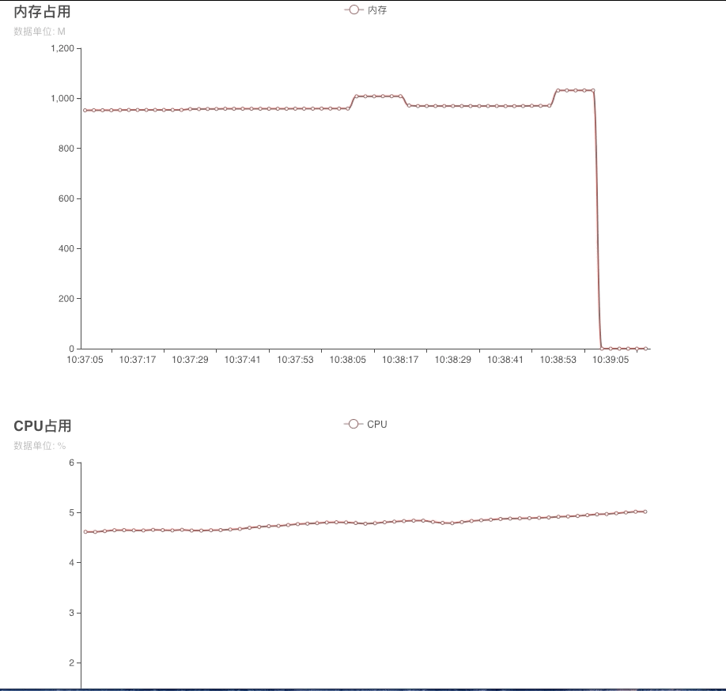
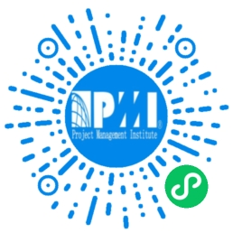

## 进程资源使用监控工具

使用该工具你可以在开发时不引入各种臃肿监控工具的情况下，采用图形化的方式将你指定应用进程的资源开销情况展示出来，这样对所开发的应用进程的各种资源占用情况做到心中有数。

目前支持 内存、CPU、线程数 三种维度的监控。

### 使用方式

*   MacOs 平台

    ./process_perf_osx -p <待监控的进程PID>

*   Linux 平台

    ./process_perf_linux -p <待监控的进程PID>

*   Windows 平台

    ./process_perf_windows -p <待监控的进程PID>

启动后会每 2S 进行一次采样，你可以使用 Ctrl+C 终止采样。采样停止时会根据已采样数据进行图表生成；生成的图表以 chart.html 文件的形成输出到命令执行的目录，你可以双击文件打开在浏览器中进行查看。

### 文件下载方式

项目最新的可执行文件可在右侧「Releases」处进行下载。

### 采样图表示例

### Q&A

使用过程中遇到的问题可在该项目 Issue 中进行反馈。

### 广告时间

    你还在为手头项目事项杂乱而烦恼吗？你还在为项目延期而着急上火吗？你还在为项目范围频繁变更而左右撕逼吗？
    让「项目管理」来助你一臂之力吧！了解 PMI 项目管理知识体系，获得 PMP 认证。
    让你的工作有方法论护航。
    这是我过去备考PMP时做的备考小程序，你可以扫码参加学习！

    

